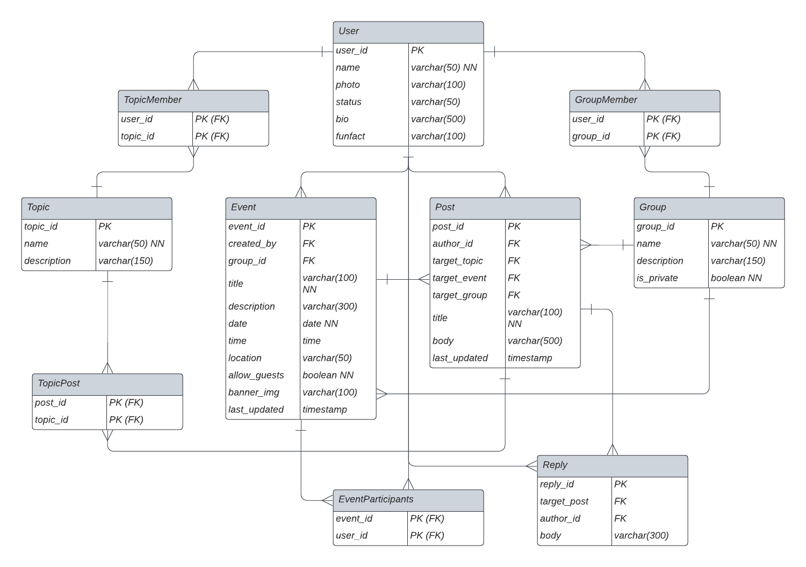

# Alumni Network
This is a case-project for the Noroff accelerate program. The purpose of the project is to display the capabilities learned during the program. Such as front- and backend development, and interaction with a database.
## Built with
### Java, Spring Boot & Spring Data JPA
Programming language and Framework used to create the Web API and run it. Spring Data JPA is used to create JPA standard repositories that act as the main interface between the API and the Database. Additionally, MapStruct is used as a code generator for abstract mapping-beans and Lombok is used for simplification of Getter-Setter logic.

### PostgreSQL & Hibernate
The Database provider is PostgreSQL and Hibernate is used together with Spring in the application to manage initialization, management and general communication with the Database.

### OpenAPI (Swagger)
Used for automatic, generative documentation of the REST API and as the main way of accessing and interacting with the API and its endpoints.

### TypeScript and React
TypeScript with react is used to build the web page. Additionally HTML and CSS is used to build the structure, and layout of the webpage.

## Architecture
The components created in this application, are created based on if they are either re-used multiple times, or it makes logical sense to divide the code. \
\
The Database Structure is based on the relationships setup through the JPA Entities in the spring application.


## Running
### Backend
To run the program download the docker image from [Docker-hub](https://hub.docker.com/repository/docker/vegardandersson/alumni-test/general) and set these env-variables.
```
POSTGRESQL_HOSTNAME=
POSTGRESQL_PORT=
POSTGRESQL_DB_NAME=
POSTGRESQL_DB_USER=
POSTGRESQL_DB_PASSWORD=

KEYCLOAK_BASE_URL=
KEYCLOAK_REALM=
KEYCLOAK_CLIENT_ID=
KEYCLOAK_CLIENT_SECRET=
KEYCLOAK_ADMIN_USERNAME=
KEYCLOAK_ADMIN_PASSWORD=
```
Then run the docker command
```bash
docker run -p 8080:8080 -d --env-file /path/to/env-file vegard/alumni-network
```

### Frontend

To run the frontend start by cloning the project from github 
```bash
git clone https://github.com/noroff-alumni-assignment-group/alumni-network.git
```

Then add a .env file with a single variable:
``` env
REACT_APP_API_URL=
```
and set it equal to the base url of your API.
Next run these two commands to download dependencies and start a development server
```bash
npm install --legacy-peer-deps
npm start
```
Alternatively instead of the npm start command create an optimized build using the following command.
```bash
npm build
```
